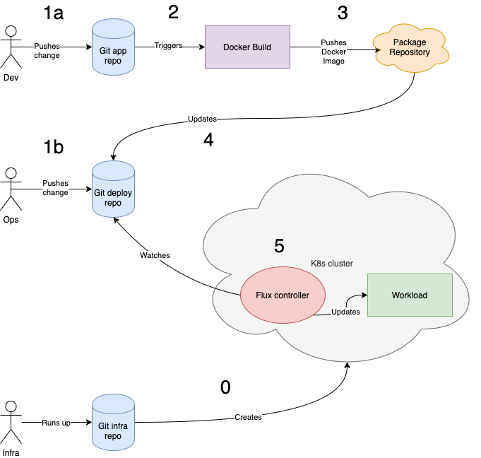

# Example GitOps Pipeline

## Why?
This repository documents a very simple GitOps set up, which can be used as a starting point for further development, experimentation, or learning.

**Skip to "Walkthrough" below if you want to just get going.**

One of the problems with setting up GitOps workflows is their sheer complexity. The number of decisions that must be made, and array of choices at these decision points make teaching it very complicated.

This example aims to:

- Demonstrate a GitOps workflow that goes from change of application or deployment code to cluster deployment in an automated, reliable and auditable fashion

- Uses free tooling

- Avoids third party vendor tools

- Be as simple as possible

## Repositories

The repositories involved are:

- [example-gitops-app](https://github.com/ianmiell/example-gitops-app)

- [example-gitops-deploy](https://github.com/ianmiell/example-gitops-deploy)

- [example-gitops-infra](https://github.com/ianmiell/example-gitops-infra) (optional, if you already have a Kubernetes cluster set up)

## Workflow

### High Level

This diagram illustrates the flow at a high level:

#### Step 0

(Optional) Infrastructure engineer creates Kubernetes cluster using Terraform.

#### Step 1a

A developer can trigger a release by updating a Git repository which contains the application code ([example-gitops-app](https://github.com/ianmiell/example-gitops-app)).

#### Step 1b

A operator can change the deployment code in [example-gitops-deploy](https://github.com/ianmiell/example-gitops-deploy).

#### Step 2

Pushing or merging the change to the `main` branch of the [example-gitops-app](https://github.com/ianmiell/example-gitops-app) triggers a Docker build process.

#### Step 3

If the Docker image build is successful, it is pushed to the Docker image repository, and has a unique hash given to it as the image reference.

#### Step 4

Following the Docker image push, the [example-gitops-deploy](https://github.com/ianmiell/example-gitops-deploy) Git repository is updated with the new image reference.

#### Step 5

Any change to the [example-gitops-deploy](https://github.com/ianmiell/example-gitops-deploy) repository (ie from Step 1a or Step 1b) will result in the Flux controller examining that repository and applying any changes that need to be made to the workload running in the cluster.

## Implementation

### Application

The application is a simple web service that outputs a 'Hello World' message to any HTTP clients.

This is the [Dockerfile](https://github.com/ianmiell/example-gitops-app/blob/main/Dockerfile).

### Application Image Build and Update Process

The build and update process for the image is implemented using [GitHub Actions](https://github.com/features/actions).

[This file](https://github.com/ianmiell/example-gitops-app/blob/main/.github/workflows/main.yml) defines the process, which falls into three parts:

- Check out the code (`actions/checkout@v2`)

- Build and publish image to Docker registry (`Publish Docker Image to GPR`)

- Inform deployment repository that the image has changed (`Repository Dispatch`)

### Deployment Git Repository Update Process

The `Repository Dispatch` step above effectively sends a message to the [example-gitops-deploy](https://github.com/ianmiell/example-gitops-deploy) Git repository containing a URL for the Docker image that was just created.

[This file](https://github.com/ianmiell/example-gitops-deploy/blob/main/.github/workflows/main.yml) defines a GitHub Action process which also falls into three parts:

- Check out the code (`Check Out The Repository`)

- Replace the image version in the deployment code (`Update Version In Checked-Out Code`)

- Commit the new image reference to the codebase (`Commit The New Image Reference`)

## Install / Set Up

See [INSTALL.md](https://github.com/ianmiell/example-gitops/blob/main/INSTALL.md)
